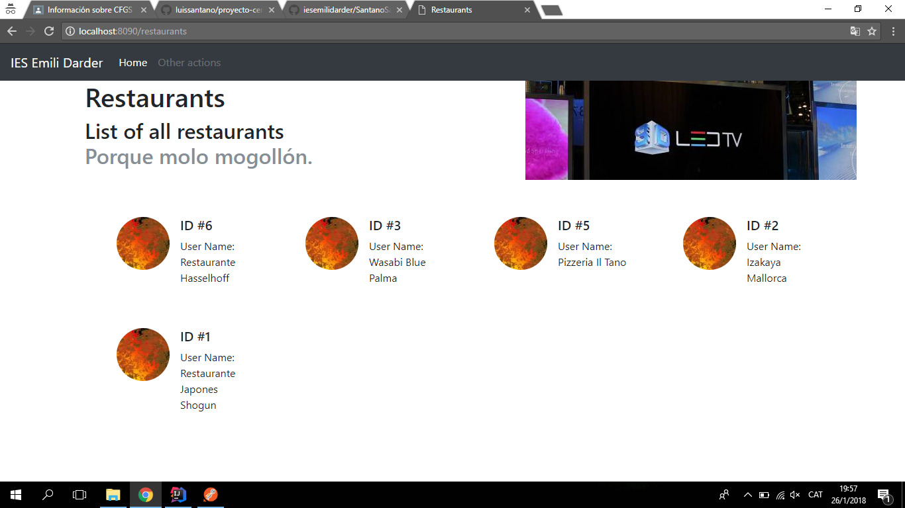
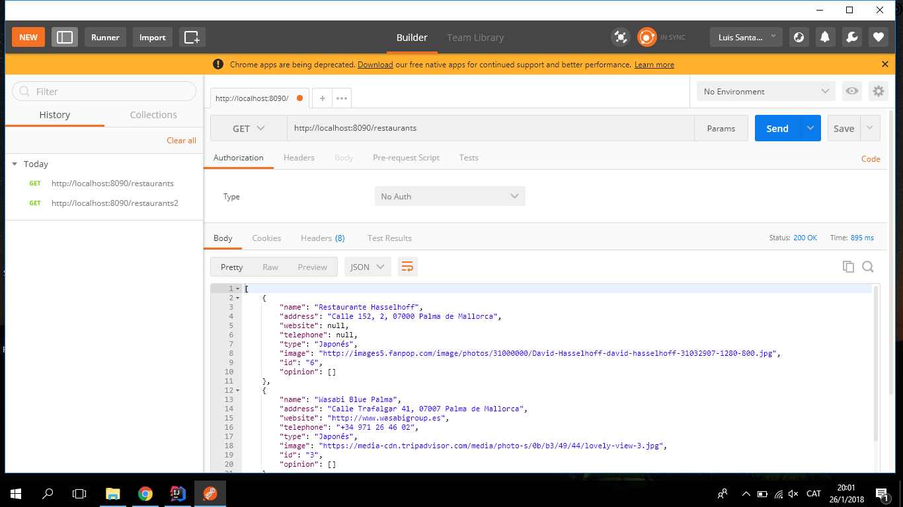
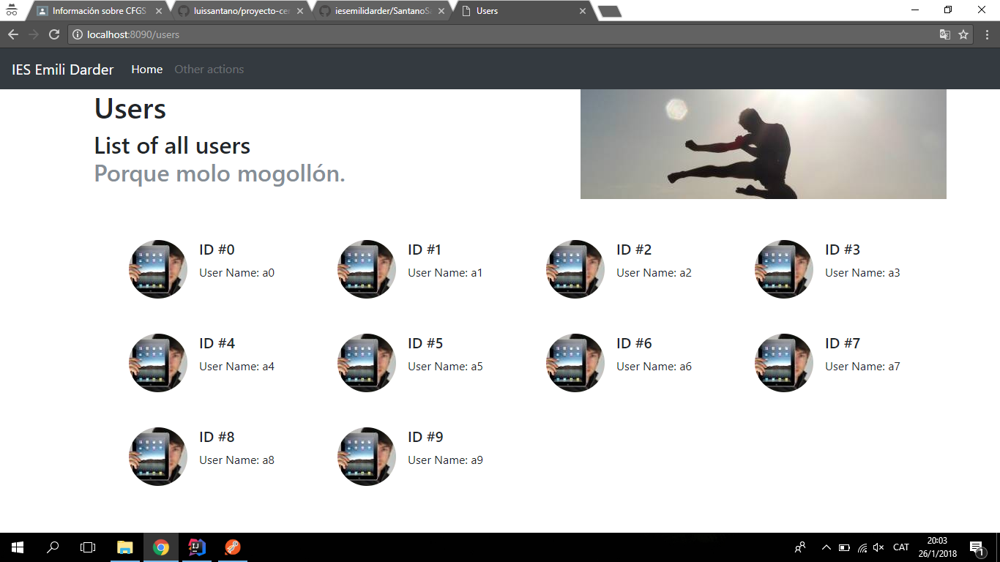
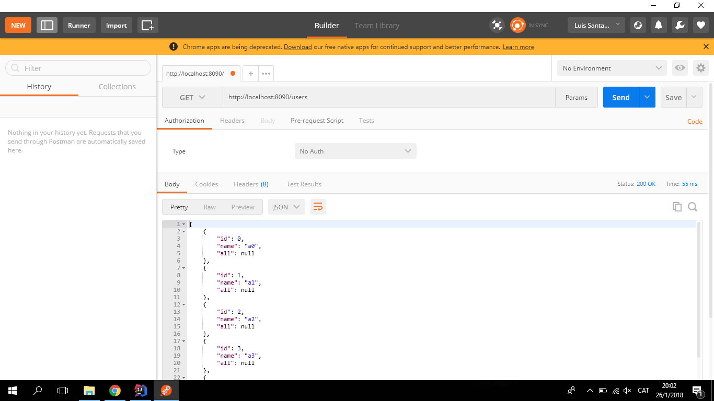

# proyecto-cero
proyecto-cero

##### Aquí se puede observar que al buscar "localhost:8090/restaurants se puede observar los diferentes restaurantes con sus ID y sus nombres.

##### En la imagen se muestra toda la información de los restaurantes en un archivo JSON. 

##### Si buscamos "Localhost:8090/users podemos ver el ID y el nombre"

##### La busqueda en le Postman sale la información de los usuarios.
