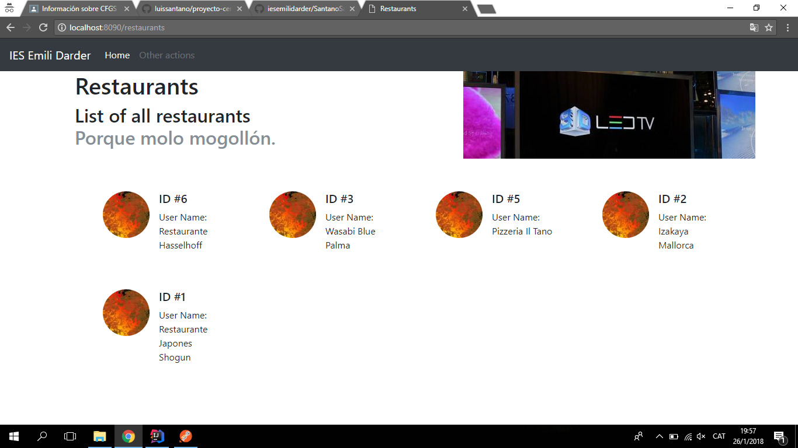
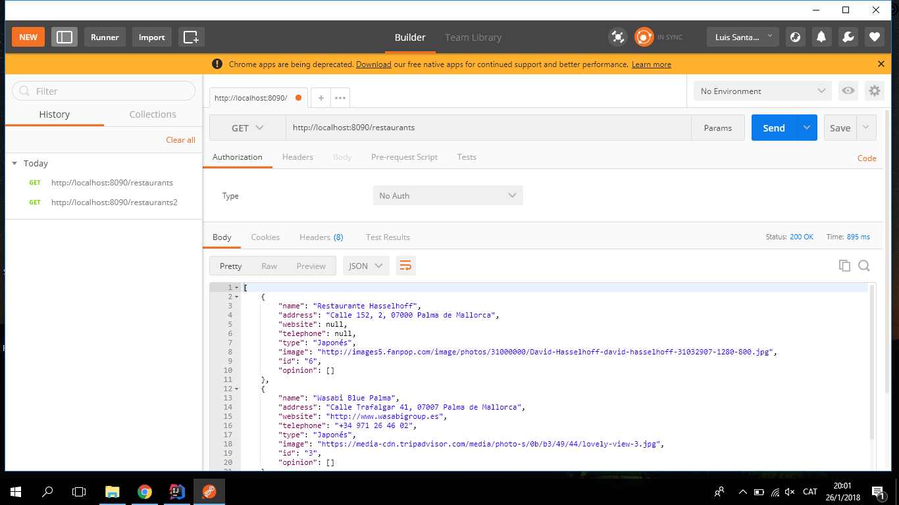
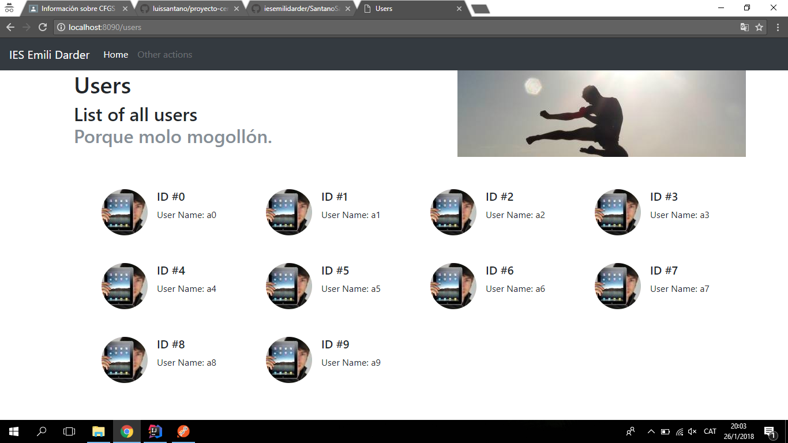
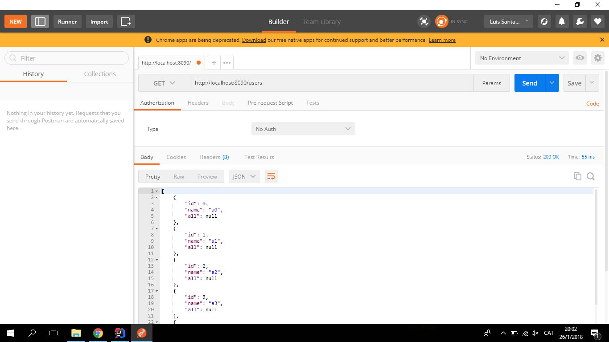

# proyecto-cero

He creado un proyecto multimodulo en el cual lo he dividido en tres modulos (Core | Presentationlayer | Restapi).

Core : En el modulo Core he puesto , la conexión de la base de datos , la clase restaurante , DBObject , IDatabaseActions y ReviewItem

======

Presentation Layer : Es la capa que se encarga de los servlets (Mostrar Restaurants y TestServlet).

restapi : Es la capa que se encarga del API (CorsFilter  , JsonTransformer , Launcher)

##### Aquí se puede observar que al buscar "localhost:8090/restaurants se puede observar los diferentes restaurantes con sus ID y sus nombres.

##### En la imagen se muestra toda la información de los restaurantes en un archivo JSON. 

##### Si buscamos "Localhost:8090/users podemos ver el ID y el nombre"

##### La busqueda en le Postman sale la información de los usuarios.

